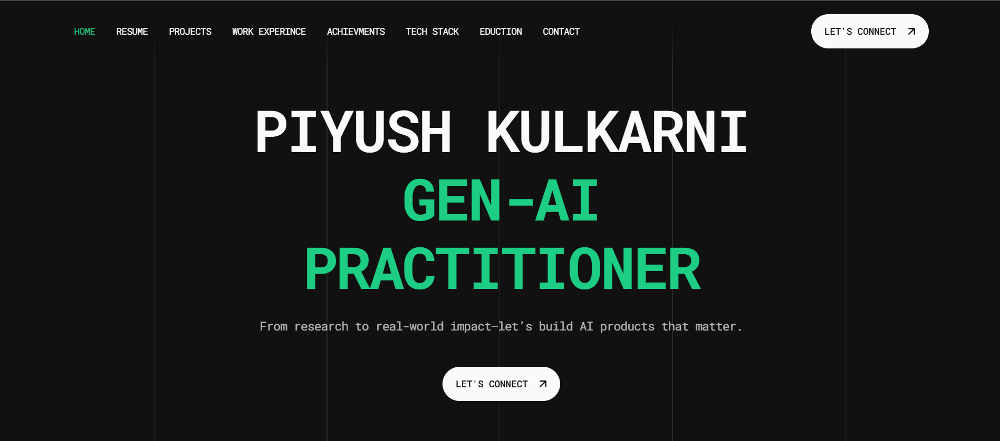

# 👋 Hello, I'm Piyush Kulkarni

> From research to real-world impact—let's build AI products that matter.

## 🧠 About Me

I'm an AI engineer from Pune, India, studying at IIIT Pune. I specialize in building practical AI applications that solve real-world problems, with expertise in Gen-AI, LLMs, agentic AI, and automation.

  

  

## 🚀 Projects

### [Athena](https://github.com/piyushk6626/Athena) - Open Source AI Assistant
**Alexa+ but free and open source**
- End-to-end task execution for shopping, booking, and more
- AI-driven generative UI with dynamic product cards
- Advanced web automation with Selenium
- Precision with OpenAI function calling
- Multilingual support
- **Tech Stack:** OpenAI API, FastAPI, Vector Embedding, Pinecone, Selenium, Flask, Flutter, Dart

### [YC Atlas](https://github.com/piyushk6626/YCAtlas) - YC Startup Discovery
**Agentic AI researcher for YC startups**
- LLM-powered semantic search for context-aware retrieval
- Autonomously conducts multi-step research
- Provides current snapshot of the startup ecosystem
- **Tech Stack:** OpenAI API, Vector Embedding, Pinecone, Selenium, Crawl4AI, Async, Streamlit

### [Carter ONDC](https://github.com/piyushk6626/CarterONDCpublic) - AI-Powered Seller Onboarding
**Conversational AI for WhatsApp commerce**
- NLP-powered AI agent for inventory creation
- Leverages WhatsApp as India's most accessible commerce gateway
- AI-driven data structuring for product details
- Vector search for intelligent discovery
- **Tech Stack:** WhatsApp API, NLP, Vector Search

### [Carter](https://github.com/YourUsername/carter) - LLM-Powered E-commerce Search
**A 10X better search engine for shopping**
- Built a semantic search using vector embeddings and LLMs
- Natural language understanding for intuitive queries
- Scrapes 12 top fashion sites for comprehensive results
- **Tech Stack:** OpenAI API, FastAPI, Vector Embedding, Pinecone, Selenium, Flask

### [Secu_Audit_AI](https://github.com/piyushk6626/CarterONDCpublic) - AI Security Automation
**Agentic workflow for CIS benchmark auditing**
- AI-powered script generation for security audits
- Rigorous quality assurance with secondary LLM
- Continuous optimization for flawless execution
- **Tech Stack:** LLM, PDF processing, Script Generation

### [Easy Audit](https://github.com/piyushk6626/CarterONDCpublic) - Security Compliance Tool
**GUI-based security audit automation**
- CIS benchmark audit automation
- Seamless GUI execution with PySide6
- Efficient reporting and search functionality
- **Tech Stack:** PySide6, PDF reporting, Database integration

### [KnowMyCollege](https://github.com/h4636oh/KnowMyCollege) - College Recommendation App
**Hackathon-winning webapp for college search**
- Personalized recommendations based on 10 key questions
- Uses weighted average algorithm with normalized parameters
- College insights through RAG pipeline and vector database
- **Tech Stack:** Pandas, Linear Regression, RAG, Vector Database

## 💻 Tech Stack

### Languages

### Frameworks & Libraries

### Cloud & DevOps

## 🏆 Achievements

- **SIH 2024**: First Rank in India (Nov 2024)
- **BITS Pilani Goa Hackathon**: First Rank in Open Innovation (Feb 2025)
- **Hackin Queen Hackathon**: Winner (Jan 2024)
- **JEE Advanced**: Among Top 2% (June 2023)
- **Linguistics Olympiad**: Top 1% in Maharashtra, India (Dec 2019)

## 🎓 Education

- **Indian Institute of Information Technology, Pune**
  - B.Tech in Computer Science and Electronics

## 😄 The Human Behind The Code

### 🎮 When I'm Not Coding
- **Trying to explain** to my parents what I actually do for a living
- **Reading** Startup Books and papers
- **Collecting** cool programming stickers I'll never actually stick anywhere
- **Hiking** Random Mountains
- **Making** obscure references nobody understands

### 💭 Random Facts
- My debugging technique involves explaining the problem to random inanimate objects
- I name my bugs after Greek gods because they seem immortal
- My Git commit messages range from "Fixed stuff" to existential poetry
- I understand regex exactly two times: when I write it and never again
- I Listen to Marathi Classic Songs Wanna try [Spotify PlayList](https://open.spotify.com/playlist/3BTphLQ7H0FSVmH84fUGo7?si=C7RfBDhsSDmJNwjdkd6q8Q)
- <iframe style="border-radius:12px" src="https://open.spotify.com/embed/playlist/3BTphLQ7H0FSVmH84fUGo7?utm_source=generator&theme=0" width="100%" height="352" frameBorder="0" allowfullscreen="" allow="autoplay; clipboard-write; encrypted-media; fullscreen; picture-in-picture" loading="lazy"></iframe>

### 🧙‍♂️ My Coding Superpower
Turning caffeine into working code at 4 AM while maintaining surprisingly decent documentation

## 📫 Let's Connect

Interested in building AI together? Reach out:

- 📧 Email: [kulkarnipiyush462@gmail.com](mailto:kulkarnipiyush462@gmail.com)
- 📱 WhatsApp: [+91 9405582136](https://wa.me/919405582136)
- 📞 Phone: +91 94055 82136

---

*"AI products that matter."*

